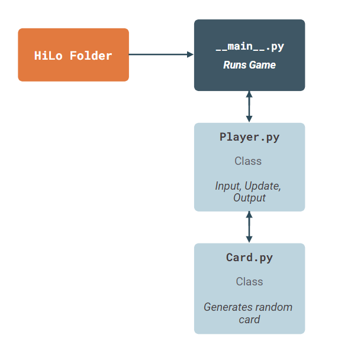

<h1>HiLo Game for CSE210: Programming with Classes</h1>

<h2>Game Overview</h2>

> HiLo is a game in which the player guesses if the next card drawn by the dealer 
> will be higher or lower than the previous one. Points are won or lost based on whether or not the player guessed correctly.

<h2>Project Structure</h2>

<h2>Rules</h2>

<h3>Hilo is played according to the following rules:</h3>

* The player starts the game with 300 points.
* Individual cards are represented as a number from 1 to 13. 
* The current card is displayed. 
* The player guesses if the next one will be higher or lower. 
* The the next card is displayed. 
* The player earns 100 points if they guessed correctly. 
* The player loses 75 points if they guessed incorrectly. 
* If a player reaches 0 points the game is over. 
* If a player has more than 0 points they decide if they want to keep playing. 
* If a player decides not to play again the game is over. 

<h2>Required Software</h2>

* Visual Studio Code or similar IDE
* Python 3.8.0 or newer

<h2>Authors</h2>

* Mikhail Cedras (mikhail.cedras@gmail.com | *mickym23*)
* Simon Mule (simycodes@gmail.com | *simycodes*)

